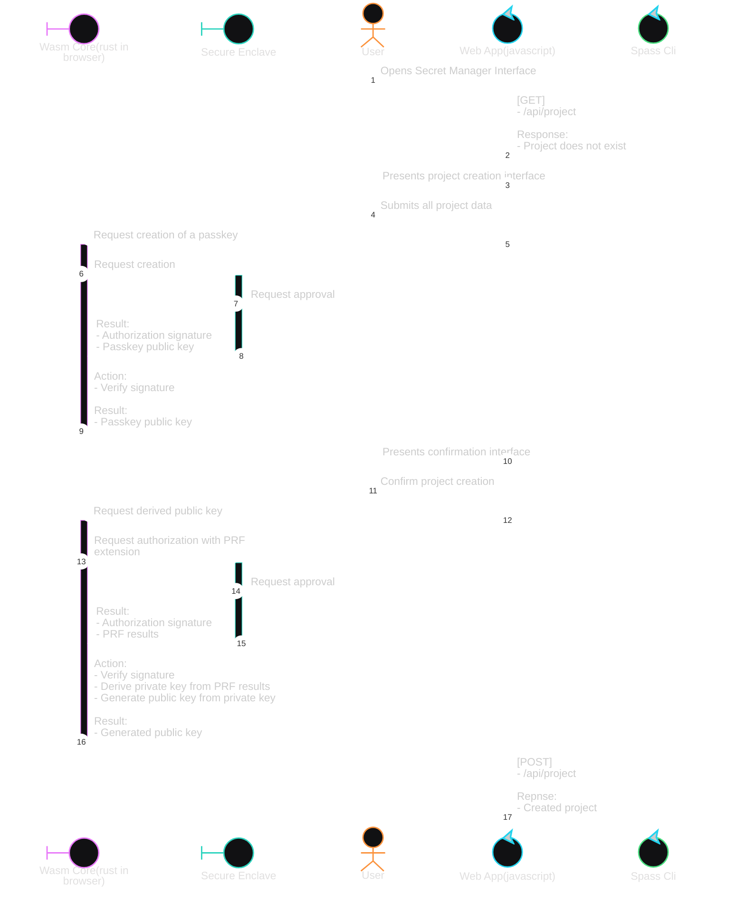
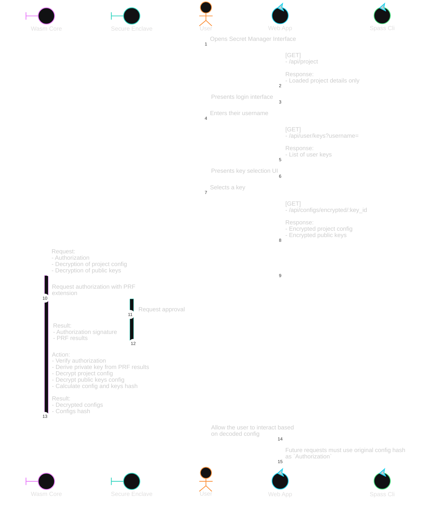
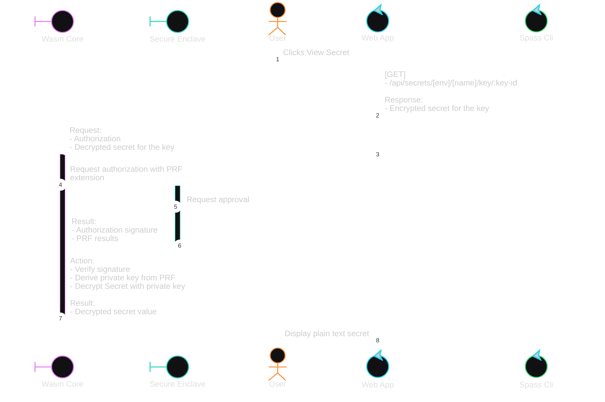
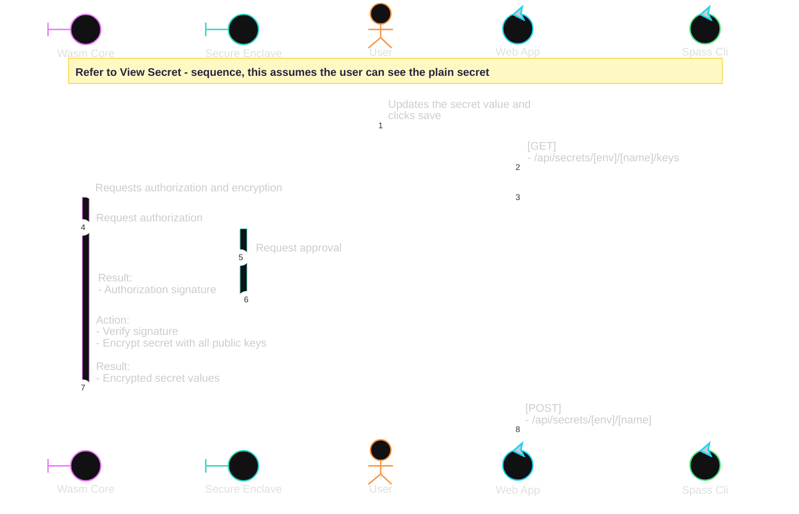
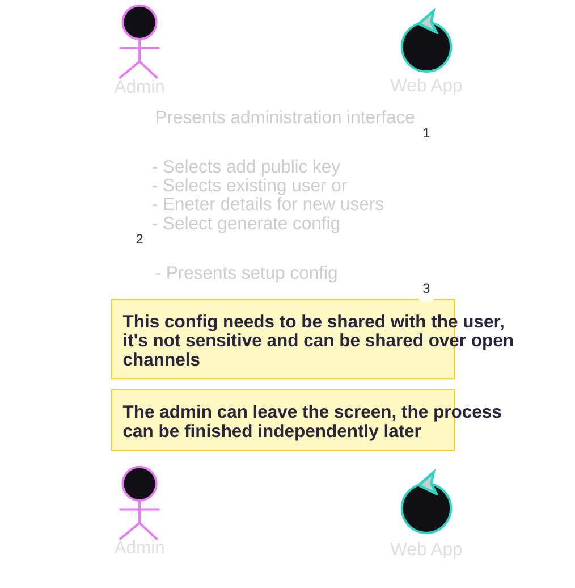
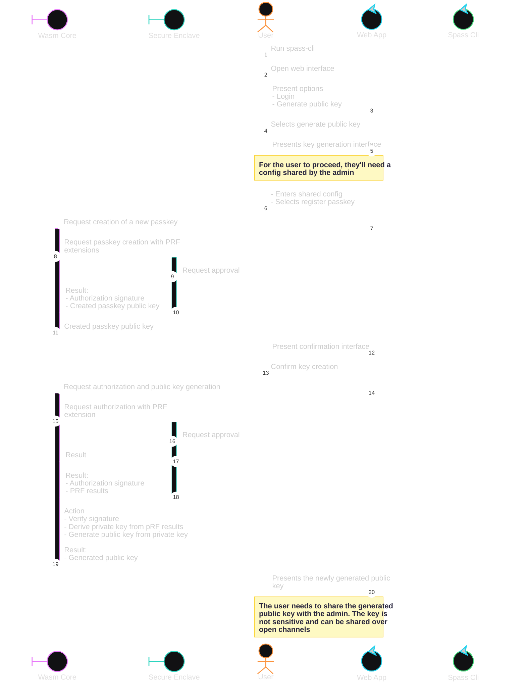
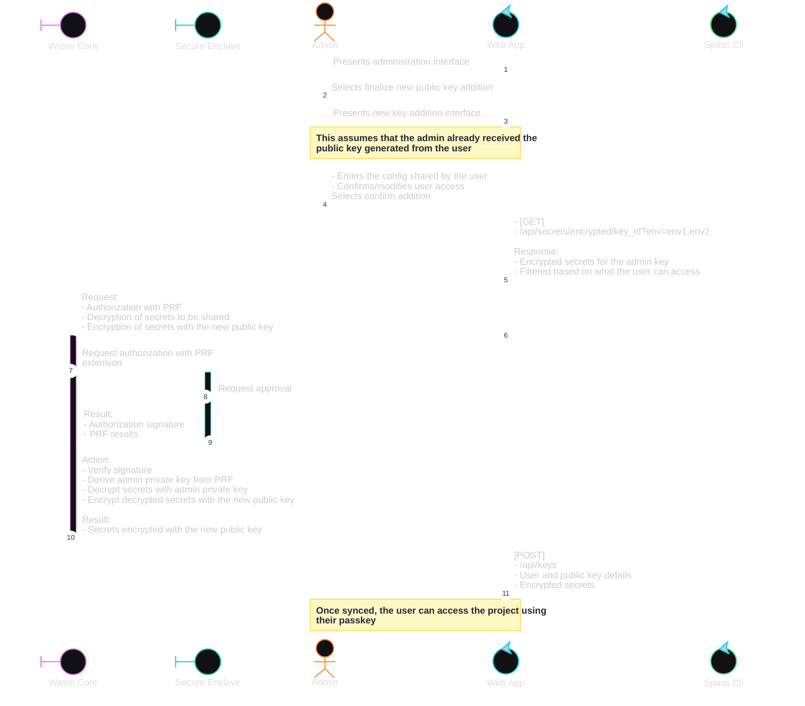
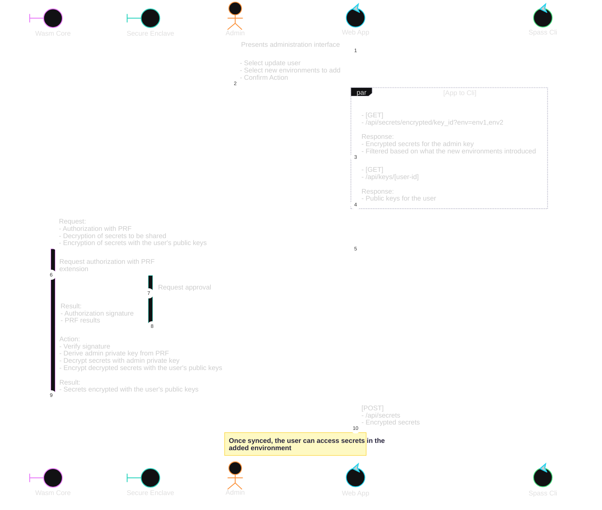
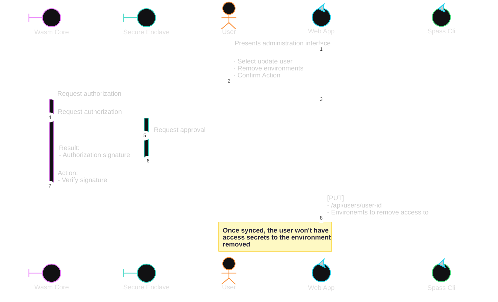

# Secretpass – Local Secret Storage

Local-based storage allows you to securely store secrets locally and sync them through git as part of your project.
These secrets are secured by passkeys and can be conveniently managed through the web interface bundled with the `spass`
cli.

The project folder `.spass` has the following structure:

- `config.json` - This file holds the primary configuration for the project including the project details, environments
  and users.
- `config.lock` - This file holds multiple copies of `config.json` encrypted with public keys of all users in the
  project.
    - This file is used to verify the authenticity of the project configuration and takes precedence over the flat file.
- `public-keys.json` - This file holds the public keys of all users and machines in the project.
- `public-keys.lock` - This file holds multiple copies of `public-keys.json` encrypted with public keys of all users in
  the project.
    - This file is used to verify the authenticity of the public keys and takes precedence over the flat file.

## Create a new project

The sequence below depicts the registration process when the user runs `spass` for the first time in a project folder
that does not have a
`.spass` folder. It creates a new project with the user as the admin.

## User Login

The sequence below depicts the login process a user goes through when they open an existing project.

**From this step onwards, this tutorial assumes the user is already logged in**

## View Secret

## Add/Modify Secret

## Adding a new public key

While adding a new public key, the process involves 3 steps:

1. Admin generates a setup config and shares it with the user.
2. The user creates a passkey, generates a public key and shares it with the admin.
3. The admin adds the public key to the project, giving the user access.

The process is the same whether the user is new or existing.

### 1. Admin: Generate setup config

### 2. User: Generate public key

### 3. Admin: complete new key addition

## Admin: Give User Env Access

## Remove User Env Access

